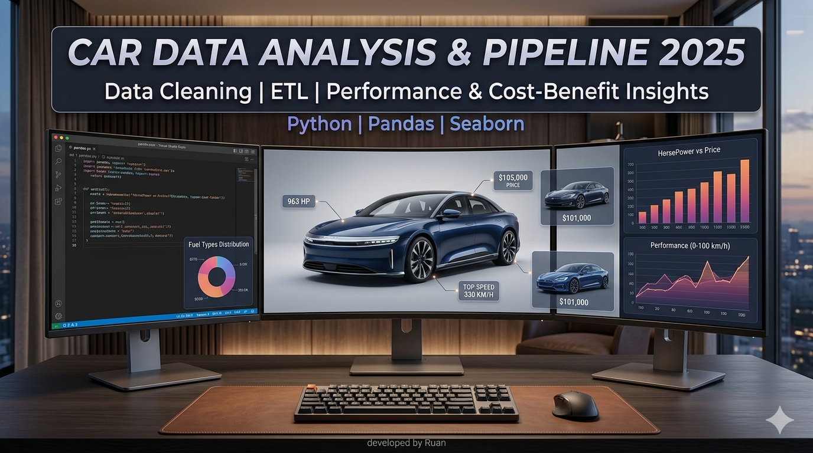
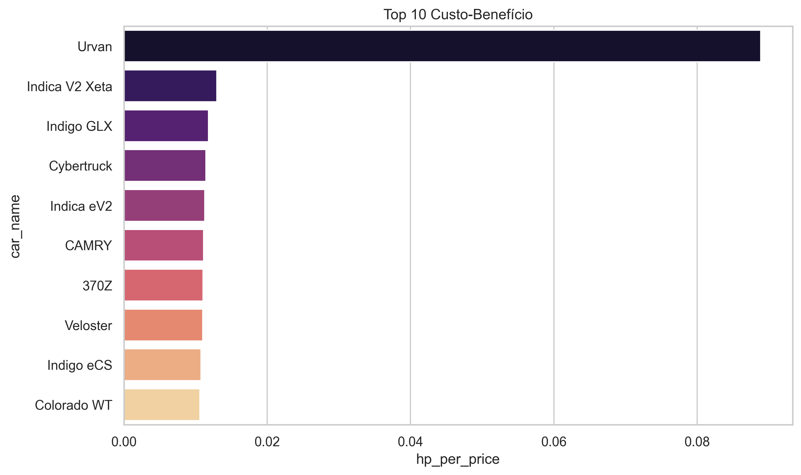
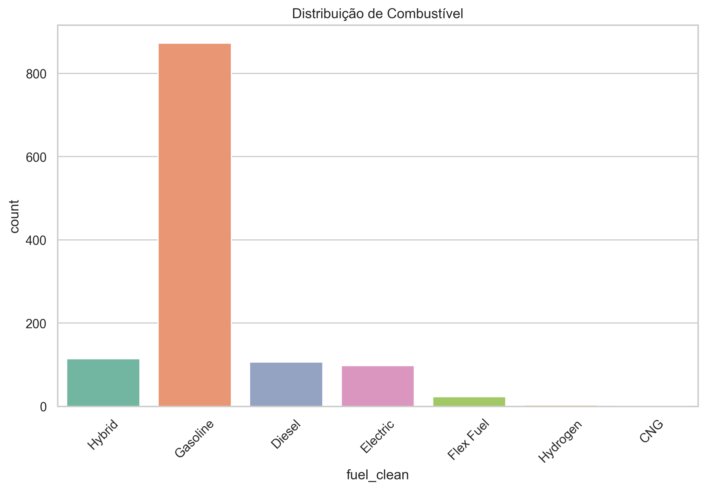
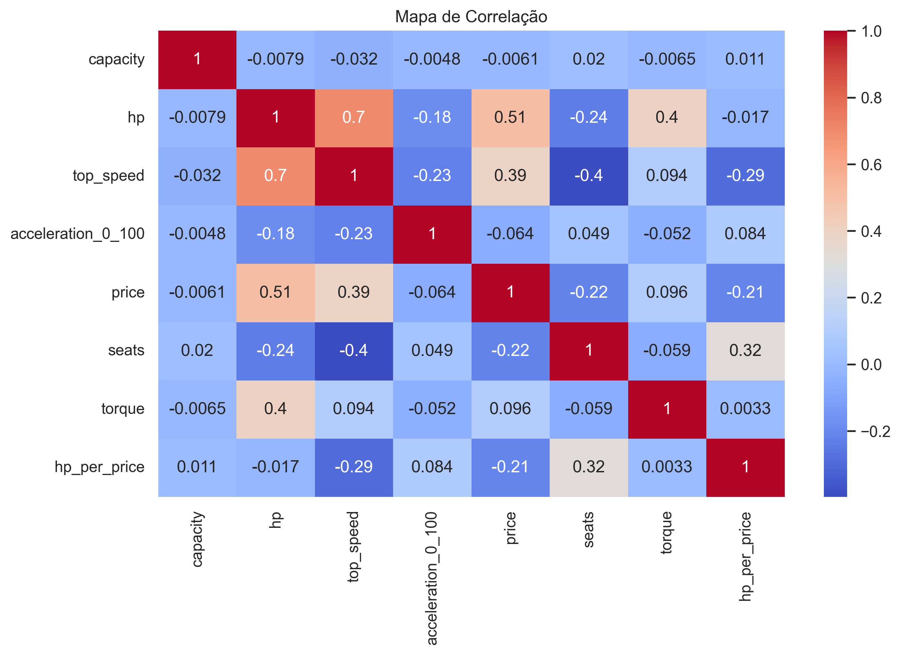

<p align="center">
  
</p>

<h1 align="center">🏎️ Pipeline de Inteligência de Mercado Automotivo</h1>

<p align="center">
  <em>Transformando dados brutos do setor automotivo em inteligência estratégica de mercado — Edição 2025</em>
</p>

<p align="center">
  
  
  
  
</p>

---

## Visão Geral

Este projeto entrega um **pipeline ETL (Extract, Transform, Load)** completo e uma **Análise Exploratória de Dados (EDA)** focados no mercado automotivo global em 2025. O projeto simula um cenário real de inteligência de mercado, onde dados brutos e não estruturados são convertidos em ativos estratégicos para análise de performance, precificação e benchmarking competitivo entre segmentos premium e populares.

---

## Arquitetura

```
Dados Brutos (CSV)
       │
       ▼
┌──────────────────────────┐
│  Tratamento de Encoding  │  ── Normalização cp1252 / latin1
└──────────┬───────────────┘
           │
           ▼
┌──────────────────────────┐
│   Limpeza e Padronização │  ── Tipagem, parsing de strings,
│         dos Dados        │     tratamento de nulos
└──────────┬───────────────┘
           │
           ▼
┌──────────────────────────┐
│  Engenharia de Features  │  ── Criação de KPIs (índice HP/Preço)
└──────────┬───────────────┘
           │
           ▼
┌──────────────────────────┐
│  Análise Estatística &   │  ── Correlação, distribuição,
│      Visualização        │     estudo multivariado
└──────────┬───────────────┘
           │
           ▼
     Dataset Limpo
  (cars_cleaned_final.csv)
```

---

## Etapas do Pipeline

### 1 · Ingestão e Tratamento de Encoding
Supera barreiras de leitura de arquivos legados (`ANSI/cp1252`), garantindo a integridade total de caracteres especiais e símbolos monetários presentes nos dados brutos.

### 2 · Limpeza e Padronização dos Dados
Normaliza campos complexos com formatação de mercado — convertendo strings como `$1.100.000` e `963 hp` em tipos numéricos (`float`/`int`) — viabilizando cálculos estatísticos precisos nas etapas seguintes.

### 3 · Engenharia de Features
Desenvolve KPIs orientados ao negócio, incluindo um **Índice de Custo-Eficiência (Cavalos por Dólar)**, projetado para identificar anomalias de mercado e oportunidades de investimento entre segmentos de veículos.

### 4 · Análise Estatística Multivariada
Investiga correlações entre potência, cilindrada, velocidade máxima e curvas de depreciação por tecnologia de combustível.

---

## Análises e Insights

### Top 10 — Custo-Benefício (Potência por Preço)

<p align="center">
  
</p>

> **O que mostra:** Os modelos com melhor desempenho bruto entregue por dólar investido, utilizando a métrica customizada `HP por Preço`.
>
> **Insight Principal:** Marcas de performance de entrada e esportivos tradicionais frequentemente superam os hipercarros de luxo nessa métrica. O preço dos últimos cresce de forma exponencial em relação ao ganho marginal de potência — um caso clássico de **retornos decrescentes no segmento premium**.

---

### Distribuição de Preços por Tipo de Combustível

<p align="center">
  
</p>

> **O que mostra:** Comparação das faixas de preço e densidade de modelos entre veículos a Gasolina, Híbridos e Elétricos no cenário de 2025.
>
> **Insight Principal:** Revela se os segmentos elétrico e híbrido já convergiram para paridade de preços competitiva com os motores a combustão — um sinal crítico para posicionamento de mercado e teses de investimento na era de transição para EVs.

---

### Matriz de Correlação (Heatmap)

<p align="center">
  
</p>

> **O que mostra:** Um mapa de calor onde cores intensas (próximas de `+1` ou `−1`) indicam relações lineares significativas entre as variáveis numéricas.
>
> **Insights Principais:**
> - **Correlação Positiva Forte:** `HorsePower` ↔ `Price` — confirma que performance comanda o prêmio de preço, como esperado.
> - **Correlação Negativa Forte:** `HorsePower` ↔ `Tempo 0–100 km/h` — valida a eficiência mecânica; maior potência resulta em menor tempo de aceleração.
> - **Utilidade para ML:** Esta matriz serve como **guia de seleção de features** para futuros modelos preditivos de precificação, sinalizando variáveis multicolineares a serem excluídas.

---

## Tecnologias Utilizadas

| Ferramenta | Finalidade |
|---|---|
| **Pandas** | Manipulação de dados, conversão de tipos e orquestração do pipeline |
| **Matplotlib / Seaborn** | Geração de gráficos estatísticos com a paleta `magma` |
| **Tratamento de Encoding** | Leitura robusta via fallback `cp1252` e `latin1` |
| **Jupyter Notebook** | Desenvolvimento interativo e análise reprodutível |

---

## Como Executar

**1. Clone o repositório**
```bash
git clone https://github.com/RuanSantos-Developer/cars-data-analysis.git
```

**2. Instale as dependências**
```bash
pip install pandas matplotlib seaborn jupyter
```

**3. Execute o pipeline**

Abra o `pipeline-cars.ipynb` e execute todas as células em sequência. O dataset limpo será exportado automaticamente como `cars_cleaned_final.csv`.

---

## Estrutura do Repositório

```
cars-data-analysis/
│
├── Cars Datasets 2025.csv       # Fonte de dados brutos
├── pipeline-cars.ipynb          # Notebook do pipeline ETL e EDA
├── cars_cleaned_final.csv       # Dataset processado e pronto para análise
├── README.md                    # Documentação do projeto
│
└── images/
    ├── banner.png
    ├── top10_hp_price.png
    ├── price_dist_fuel.png
    └── heat-map.png
```

---

<p align="center">
  Desenvolvido por <strong>Ruan</strong> &nbsp;·&nbsp;
  <a href="www.linkedin.com/in/ruan-santos-780442218">LinkedIn</a> &nbsp;·&nbsp;
</p>